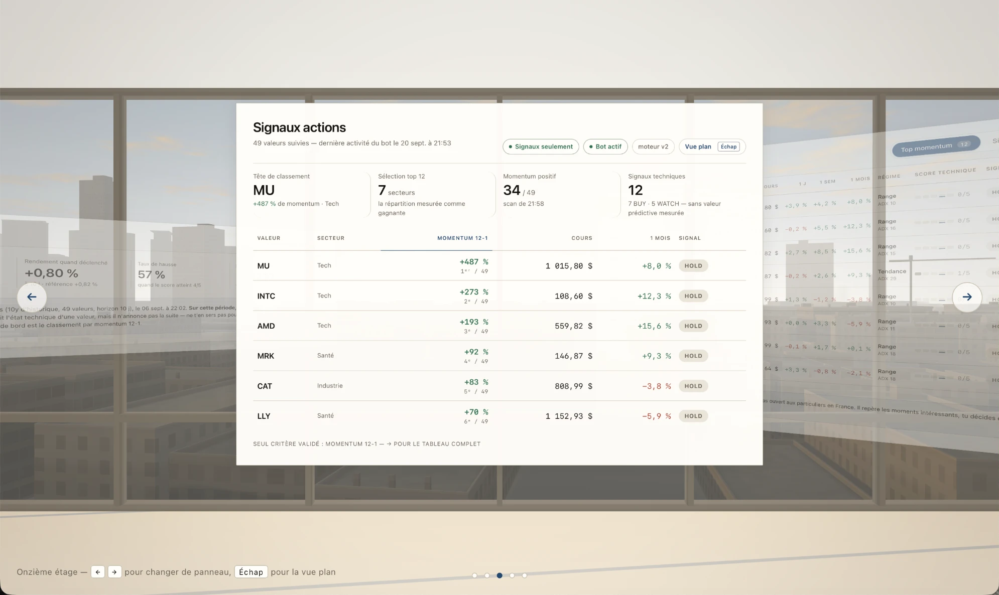

# Signaux actions

**Stock signals, measured before they are trusted.**
Python · pandas · WebGL2 · PyObjC — by [Mathis Soupizon](https://patapain18.github.io/#signaux-actions)



A bot scans **49 large US companies every five minutes**, ranks them by
momentum and technical state, and tells me what moved. **It places no order:**
I decide, by hand. Its dashboard is a native macOS app whose main view is a
room — five glass panels hanging in front of a city drawn in raw WebGL2, with
the real sun, its shadows and passing clouds.

The part that matters most is the measurement. A signal that has not been
measured is an opinion, so every ranking is replayed session by session
against 200 shuffled versions of itself — the same signals, handed to the
wrong stocks — and compared with simply holding everything.

## What the measurements say

On 49 large US stocks, marked every session, with confidence intervals:

- **The engine's own score has no detectable predictive power**
  (information coefficient −0.024 over ten years, 10-day horizon). It
  describes the technical state of a stock; it does not announce what comes
  next. The dashboard says so, permanently.
- **12-1 momentum beats chance** against a label-permutation null (100th
  percentile) — but its risk-adjusted return is indistinguishable from simply
  holding the equal-weight basket: Sharpe 0.932 against 0.935, 95 % CI of the
  difference [−0.38, +0.30]. The least bad criterion, not a validated one.
- **Post-earnings drift (PEAD)** was tested with the same protocol and
  rejected: indistinguishable from chance on large caps, with more than
  twice the turnover.

An audit on 7 September 2026 overturned three of the four claims that used
to be written here; the corrected numbers replaced them. The full log, in
French, is in [docs/notes.md](docs/notes.md).

## How it works

| Part | Files |
|---|---|
| The scanner, run every five minutes by `launchd` | `stock_bot.py` |
| The signal engine: regime detection (ADX), distances in ATR, volume confirmation, rolling calibration | `stock_engine.py` |
| The measurement: replay, information coefficient, random and permutation nulls, bootstrap | `stock_eval.py`, `pead_test.py` |
| The dashboard server (local only, `127.0.0.1:8770`) | `web/server.py`, `web/static/` |
| The room: raw WebGL2, procedural city, NOAA sun position, two shadow maps | `web/static/vue3d.js`, `web/static/vue3d_ville.js` |
| The native window (WKWebView through PyObjC) | `web/dashboard_app.py`, `web/fenetre_native.py` |

It started in April 2026 as crypto bots — grid, scalping, machine learning —
with a backtester to compare them. They are still here (`bot.py`,
`grid_bot.py`, `backtester.py`, `ml_backtester.py`, `compare_strategies.py`),
no longer wired to the dashboard.

## Run it

```bash
pip3 install -r requirements.txt
python3 stock_bot.py                              # the scanner, every five minutes, in the terminal
python3 web/server.py                             # the dashboard → http://127.0.0.1:8770
python3 stock_eval.py --period 5y --horizon 10    # measure the signal
```

The interface is in French. API keys live in `.env`, never in the repository
(template: `.env.example`); `data/` and `logs/` stay on the machine that runs
the bot. This is a personal research project, not financial advice.

---

## En français

**Des signaux boursiers, mesurés avant d'être crus.** Un bot scanne 49 grandes
valeurs américaines toutes les cinq minutes, les classe par momentum et par
état technique, et ne passe aucun ordre : c'est moi qui décide, à la main. Le
tableau de bord est une appli macOS native dont la vue principale est une
pièce : cinq panneaux de verre devant une ville dessinée en WebGL2 brut, avec
le vrai soleil, ses ombres et les nuages.

Le cœur du projet, c'est la mesure : chaque classement est rejoué séance par
séance face à 200 versions mélangées de lui-même — les mêmes signaux,
attribués aux mauvaises valeurs. Verdict honnête : le score
du moteur ne prédit rien de décelable ; le momentum 12-1 bat le hasard mais
pas le simple panier équipondéré une fois le risque pris en compte ; le PEAD
est écarté.

Le mode d'emploi au quotidien, toutes les mesures et leur historique :
[docs/notes.md](docs/notes.md).
